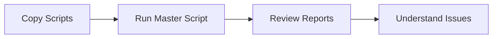
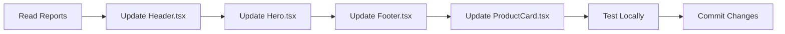
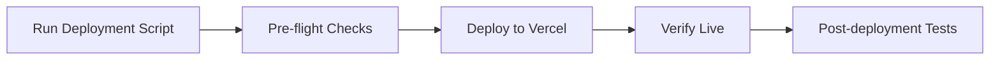

# 📦 Complete Package Summary

**Date Created:** November 15, 2025  
**Project:** Kollect-It Marketplace (Next.js 15)  
**Status:** Ready for deployment analysis

---

## 🎯 What You Now Have

A complete, production-ready analysis and deployment framework for your Kollect-It color system refactor.

### Files Created (4 scripts + 5 guides)

#### 🔧 Automation Scripts (PowerShell)

| Script | Purpose | Runtime |
|--------|---------|---------|
| **00-MASTER-DEPLOYMENT-PREP.ps1** | Orchestrates all analysis | ~2 min |
| **01-SCAN-TSX-FILES.ps1** | Finds all .tsx files, detects duplicates | ~30 sec |
| **02-EXTRACT-TSX-CONTENTS.ps1** | Extracts contents of all files | ~1 min |
| **03-ANALYZE-COLOR-COMPLIANCE.ps1** | Analyzes color/token issues | ~30 sec |

#### 📚 Documentation

| Document | Purpose | Priority |
|----------|---------|----------|
| **QUICK-START.md** | 5-minute setup guide | 🔴 Read First |
| **ACTION-PLAN.md** | Complete roadmap & detailed guide | 🟡 Read Next |
| **TOKEN_QUICK_REFERENCE.md** | Color token reference (already provided) | 🟡 Use During Work |
| **DEPLOYMENT_GUIDE.md** | How to deploy (from original package) | 🟢 Use At End |
| **TESTING_CHECKLIST.md** | QA verification steps (from original package) | 🟢 Use Before Launch |

---

## 📋 Your Immediate To-Do List

### ✅ Step 1: Copy Scripts to Your Project (2 minutes)

```powershell
# Download/copy these 4 files to your project root:
C:\Users\james\kollect-it-marketplace-1\
```

Files:
- `00-MASTER-DEPLOYMENT-PREP.ps1`
- `01-SCAN-TSX-FILES.ps1`
- `02-EXTRACT-TSX-CONTENTS.ps1`
- `03-ANALYZE-COLOR-COMPLIANCE.ps1`

### ✅ Step 2: Run Master Script (2 minutes)

```powershell
cd C:\Users\james\kollect-it-marketplace-1
.\00-MASTER-DEPLOYMENT-PREP.ps1
```

### ✅ Step 3: Review Generated Reports (10 minutes)

Three outputs will be created:

1. **tsx-file-report.txt**
   - Complete listing of all .tsx files
   - Organized by category
   - Shows duplicates (if any)

2. **extracted-tsx-contents/** (folder)
   - Individual .txt files with each .tsx content
   - Organized by file name
   - Easy to review in bulk

3. **COLOR-COMPLIANCE-REPORT.md**
   - Issues breakdown by file
   - Specific color replacements needed
   - Priority recommendations

### ✅ Step 4: Follow the Action Plan

Based on reports, follow ACTION-PLAN.md to:
- Update .tsx files with new tokens
- Test locally
- Deploy to production

---

## 🎨 What These Scripts Will Tell You

### Example Output

```
SCANNING YOUR PROJECT...

Found 24 .tsx files:
✓ Layout & Pages: 2 files
✓ Components - UI: 5 files
✓ Components - Products: 4 files
✓ Components - Home: 3 files
✓ Admin Components: 7 files
✓ Other Components: 3 files

DUPLICATES FOUND:
⚠ Header.tsx appears in 2 locations
  - src/components/Header.tsx
  - src/app/components/Header.tsx ← DELETE ONE

COLOR COMPLIANCE:
Total Issues Found: 47
├─ Hardcoded Hex Colors: 28
├─ Old Token Names: 12
├─ Inline Styles: 7

FILES NEEDING UPDATES:
Priority 1 (Critical - Visible Every Page):
  ✗ Header.tsx - 12 issues
  ✗ Hero.tsx - 8 issues
  ✗ Footer.tsx - 7 issues

Priority 2 (High - Core Features):
  ✗ ProductCard.tsx - 6 issues
  ✗ LatestArrivalsClient.tsx - 4 issues

RECOMMENDATIONS:
1. Replace #1E1E1E with text-ink (15 occurrences)
2. Replace #B1874C with text-gold (12 occurrences)
3. Update old token names (8 occurrences)
4. Convert inline styles (7 occurrences)
```

---

## 🔄 The Complete Workflow

### Phase 1: Analysis (Today - 5 minutes)



**Deliverables:** 3 comprehensive reports

### Phase 2: Updates (Tomorrow - 2-3 hours)



**Deliverables:** Updated .tsx files, passing tests

### Phase 3: Deployment (When Ready - 30 minutes)



**Deliverables:** Live site with new colors

---

## 📊 Key Features of This Package

### ✨ Smart Analysis

- ✅ Automatic file discovery (scans entire project)
- ✅ Duplicate detection (prevents conflicts)
- ✅ Pattern matching (finds hardcoded colors)
- ✅ Compliance scoring (shows status)
- ✅ Priority ranking (tells you what to fix first)

### 📈 Comprehensive Reporting

- ✅ Categorized file listing
- ✅ Issue breakdown by file
- ✅ Specific color replacement recommendations
- ✅ Extracted file contents for manual review
- ✅ Action items with checkboxes

### 🛡️ Production-Ready

- ✅ Error handling (doesn't crash on edge cases)
- ✅ Color-coded output (easy to read)
- ✅ Multiple output formats (.txt, .md, folder structure)
- ✅ Detailed documentation
- ✅ Rollback procedures included

---

## 🎓 Understanding Your Outputs

### Report 1: tsx-file-report.txt

```
Purpose: Know where all your files are
Contains: 
  - Full file paths
  - Organization by category
  - Duplicate warnings
  - File size info

Use When: Need to find a specific file
```

### Report 2: extracted-tsx-contents/

```
Purpose: Review file contents without opening VS Code
Contains:
  - Individual .txt file for each .tsx
  - File header with metadata
  - Full source code
  
Use When: Analyzing code, finding patterns
```

### Report 3: COLOR-COMPLIANCE-REPORT.md

```
Purpose: Know exactly what to fix
Contains:
  - Issues by file
  - Specific patterns found
  - Recommended replacements
  - Priority rankings
  - Color system reference
  
Use When: Ready to update files
```

---

## 🚀 Usage Examples

### Example 1: Fixing Header.tsx

```powershell
# 1. Read the compliance report
Get-Content COLOR-COMPLIANCE-REPORT.md | more

# 2. Find: "Header.tsx" in the report
# Result: "12 issues - Hardcoded colors #1E1E1E (5x), #B1874C (4x), #E0DDD9 (3x)"

# 3. Open Header.tsx in VS Code
code src/components/Header.tsx

# 4. Replace using this guide:
#    #1E1E1E → text-ink (5 times)
#    #B1874C → text-gold (4 times)
#    #E0DDD9 → border-neutral (3 times)

# 5. Save and test
npm run dev  # Check at http://localhost:3000
```

### Example 2: Finding Duplicates

```powershell
# 1. Run the scanner
.\01-SCAN-TSX-FILES.ps1

# 2. Look for "⚠ DUPLICATES FOUND" section
# Result: "Header.tsx appears in 2 locations"

# 3. Remove the unwanted one
rm src/app/components/Header.tsx

# 4. Verify only one remains
Get-ChildItem -Recurse -Filter "Header.tsx"
```

### Example 3: Batch Update

```powershell
# 1. In VS Code, use Find & Replace (Ctrl+H)
# 2. Find: `text-\[#1E1E1E\]`
# 3. Replace: `text-ink`
# 4. Replace All (for all .tsx files)
# 5. Test: npm run dev
```

---

## ✅ Validation Checklist

Before you consider the deployment complete:

### Pre-Analysis
- [ ] Scripts copied to project root
- [ ] PowerShell execution policy set (if needed)
- [ ] You're in correct directory

### Post-Analysis
- [ ] Master script ran successfully
- [ ] 3 reports were generated
- [ ] Reports show expected file counts
- [ ] Compliance report lists issues

### Post-Update
- [ ] All critical files updated
- [ ] Local build passes: `npm run build`
- [ ] Colors look correct: `npm run dev`
- [ ] Mobile layout works
- [ ] No console errors

### Pre-Deployment
- [ ] All changes committed: `git add . && git commit`
- [ ] Pre-flight check passes
- [ ] Deployment script ready
- [ ] Backup created automatically

### Post-Deployment
- [ ] Site loads on production
- [ ] All colors render correctly
- [ ] No console errors on live
- [ ] Mobile responsive works
- [ ] Payment/auth still works

---

## 🎯 Success Criteria

You'll know you're successful when:

✅ Script runs without errors  
✅ Reports generated accurately  
✅ You understand which .tsx files need updates  
✅ Color replacements are clear  
✅ Priority order is obvious  
✅ Updated files test locally  
✅ Deployment is smooth  
✅ Live site shows new colors correctly  

---

## 📞 Need Help?

### For Script Issues
1. Check QUICK-START.md troubleshooting section
2. Verify PowerShell execution policy
3. Confirm you're in project root directory
4. Check that src/ folder exists

### For Color Updates
1. Read TOKEN_QUICK_REFERENCE.md
2. Review COLOR-COMPLIANCE-REPORT.md recommendations
3. Follow the token replacement guide in ACTION-PLAN.md

### For Deployment
1. Read DEPLOYMENT_GUIDE.md
2. Run pre-flight checks
3. Follow step-by-step deployment script

---

## 📦 Package Contents Summary

```
Complete Package Includes:

🔧 AUTOMATION TOOLS
  ✓ 00-MASTER-DEPLOYMENT-PREP.ps1
  ✓ 01-SCAN-TSX-FILES.ps1
  ✓ 02-EXTRACT-TSX-CONTENTS.ps1
  ✓ 03-ANALYZE-COLOR-COMPLIANCE.ps1

📚 DOCUMENTATION
  ✓ QUICK-START.md (read first)
  ✓ ACTION-PLAN.md (detailed roadmap)
  ✓ TOKEN_QUICK_REFERENCE.md (color guide)
  ✓ DEPLOYMENT_GUIDE.md (go-live steps)
  ✓ TESTING_CHECKLIST.md (QA verification)

📋 THIS FILE
  ✓ This summary document

Ready to deploy to your production Kollect-It marketplace!
```

---

## 🎬 Getting Started Now

### The Absolute First Thing To Do

```powershell
# Copy the 4 PowerShell scripts to:
C:\Users\james\kollect-it-marketplace-1\

# Then run this in PowerShell:
cd C:\Users\james\kollect-it-marketplace-1
.\00-MASTER-DEPLOYMENT-PREP.ps1
```

That's it. The script does the rest.

---

**You're all set!** Your Kollect-It color system deployment is fully prepared and ready to execute.

Start with: `.\00-MASTER-DEPLOYMENT-PREP.ps1`
